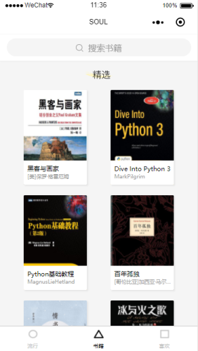
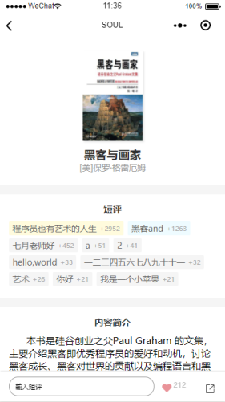
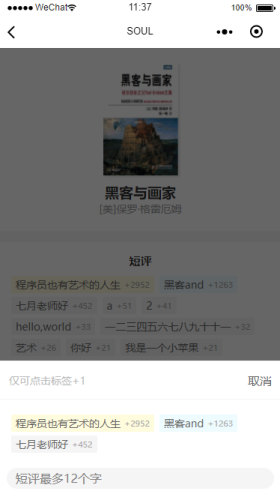
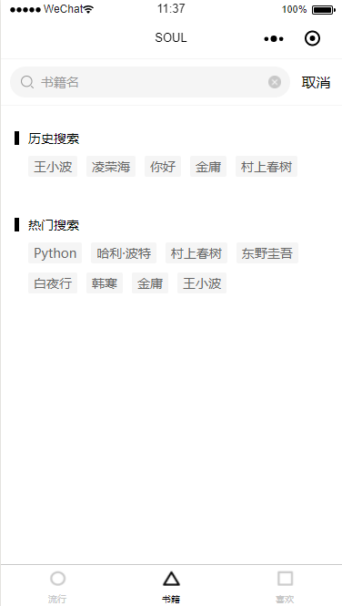
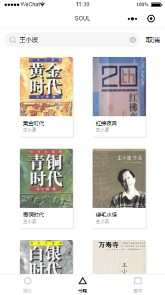
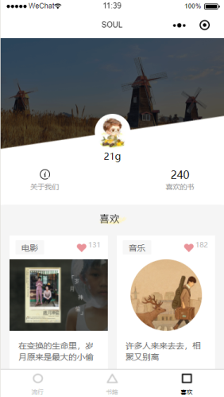

# 小程序（SOUL）

## 1. 项目描述

微信小程序（SOUL）主要分为三部分：流行、书籍、喜欢。流行主要对每期期刊进行展示，包括电影经典台词、语句、音乐。书籍主要展示精选书籍，可以查看书籍详情介绍，对书籍进行搜索、评论、点赞等。喜欢主要展示个人点赞喜欢的期刊等。

本项目主要采用组件化开发。使用了组件的特性：Slot插槽、Behavior行为、externalClass外部样式、组件事件；同时使用 WXS 对 WXML 中的一些页面逻辑进行了处理。本项目也对请求进行统一封装。

## 2. 如何运行

+ 将项目克隆到本地。项目地址：<https://gitee.com/MiniProgramToLRH/miniprogram-soul.git>
+ 使用微信小程序开发工具打开项目文件。
+ 手机端调试，需要打开调试模式才能正常发送请求请求到数据。

## 3. 项目备注

+ [项目各组件简介](./readme/项目组件简介.md)

## 4. 项目截图

### 流行板块

  

### 书籍板块

    

### 喜欢板块

 