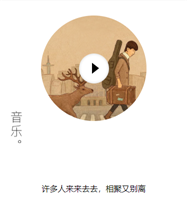
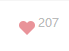
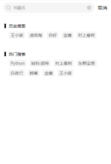
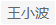
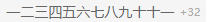
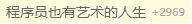

# 项目组件简介

## 1. classic 组件（期刊组件）

  

movie组件、music组件、essay组件使用 behaviors（用于组件间代码共享）设置共同的 properties（组件的对外属性，是属性名到属性设置的映射表）。分别为：

+ img：String, 组件显示的图片内容
+ content：string, 组件显示的文本内容
+ hidden：Boolean, 控制组件的显示和隐藏

### 1.1 classic/movie 组件（电影期刊组件）、classic/essay 组件（句子期刊组件）

movie组件 和 essay组件 主要用于内容的显示

### 1.2 classic/music 组件（音乐期刊组件）

mussic组件 除了对于内容的显示，还需要对音乐进行控制。

除了 behaviors（组件代码共享） 中的属性，music组件还存在如下属性：

+ src：String, 组件播放音乐的src
+ title：String, 组件播放音乐的音频标题

mussic组件 通过微信小程序API wx.getBackgroundAudioManager()（背景音频管理器） 对音乐进行控制。如果当期刊进行切换，切换到音乐期刊的时候，当前音乐期刊应保持暂停播放状态。所以可以通过当前播放的音乐src 与 当前期刊音乐src 进行比较，如果相同，则设置页面播放状态为播放，如果不相同，则播放状态为暂停

+ 当前播放音乐src：可以通过 wx.getBackgroundAudioManager(微信背景音频管理器) 获取
+ 当前音乐期刊src：可以通过 properties 中的 src 进行获取

注意：

+ 背景音频管理在真机测试时，会有音频管理显示在手机状态栏，所以需要状态栏控制与页面音频控制保持同步。
+ 当音频播放结束的时候，应停止播放音频，所以需要对 onEeded 事件进行监听，不要遗漏

## 2. navi 组件（期刊切换组件）

navi组件 properties 接受属性为：

+ title：String, 组件显示的文本内容
+ first：Boolean, 用于控制组件切换上一个（期刊）是否禁用。（当期刊为第一个时, 切换上一个期刊应该被禁用）
+ latest：Boolean, 用于控制组件切换下一个（期刊）是否禁用。（当期刊为最后一个时，切换下一个期刊应该被禁用）

navi组件 triggerEvent 触发事件为：

+ left：切换上一个（期刊）事件
+ right：切换下一个（期刊）事件

## 3. episode 组件（期刊 期数-日期 组件）

navi组件 properties 接受属性为：

+ index：String, 期刊刊数

组件内通过 observer 对期刊刊数 小于10 进行 加0 操作，此时定义 _index 用于保存 加0 操作之后的期刊数。可以通过 WXS 代替实现

注意：不要再 observer 中修改自身属性，否则会内存泄露

## 4. like 组件

like组件 properties 接受属性为：

+ like：Boolean, 当前状态是否为喜欢状态
+ count：Number, 喜欢的数量
+ readOnly：Boolean, 设置只读，不可进行喜欢或取消喜欢操作

like组件 triggerEvent 触发事件为：

+ like：喜欢或取消喜欢操作，携带参数 behavior。behavior取值如下：
  + like：表示喜欢点赞操作
  + cancel：表示取消喜欢操作

## 5. book 组件

book组件 properties 接受属性为：

+ book：Object, 书籍信息

book组件 跳转页面跳转至 book-detail Page页面，携带参数为 bid（当前书籍的id）

## 6. search 组件

 

search组件 中将历史搜索存储于本地缓存中，加载更多书籍独立封装在 behaviors 中

search组件 properties 接受属性为：

+ dataArray: Array, 书籍信息数组
+ total: null, 书籍总数量
+ noneResult: Boolean, 是否还存在搜索结果
+ loading: Boolean, 数据加载loading
+ more：String, 页面滚动到底部标识

search组件 triggerEvent 触发事件为：

+ cancel：取消搜索

历史搜索

将历史搜索进行封装，封装在 models/keyword 中，通过 getHistory 获取本地缓存的搜索历史，通过 addToHistory 将搜索关键字存入本地缓存中

+ 通过 addToHistory 将关键字存入缓存时，应在请求返回成功的时候进行，防止请求不成功，反而将搜索关键字进行了存储
+ 通过 maxLength 对历史缓存进行限制，只允许存储 maxLength 个历史数据

获取更多数据（上拉加载更多数据）

在 book Page页面中，通过监听微信小程序API onReachBottom(页面上拉触底事件) 得知页面触底。向 search 组件传递属性 more(页面滚动到底部标识)。在 search组件 中，通过对 more标识 改变的监听，触发加载更多数据的函数

+ more：页面滚动到底部标识，使用随机码进行标识。如果使用 true/false ，当页面触底时，将标识设置为true，如果页面再次触底，标识将无法改变，一直未true。在search组件中，则无法通过监听more标识的改变，加载更多数据。
+ 当用户每次上拉触底时，会加载更多数据。此时，需要防止用户在请求没有返回的时候，再次触底发送请求。可以通过锁的概念，对请求进行限制。当用户发送请求的时候，进行上锁。请求返回成功是进行解锁。此时需要注意，当请求失败时，也需要进行解锁，防止出现死锁的状态。
+ 加载更多数据的时候，当服务端没有更多数据返回的时候，此时应禁止用户发送请求。可以通过对数据总个数的判断服务端是否存在数据，从而禁止用户发送请求。
+ 当用户取消搜索和清空搜索框的时候，需要对数据进行清空和还原操作。

## 7. tag 组件

  

tag组件 主要用于对短评内容的显示，可以修改tag组件颜色，还可以在其后面添加内容

+ 样式修改：主要通过 externalClasses(外部样式) 进行修改
+ 内容扩展：主要通过 启用slot(设置multipleSlots: true) 来进行内容的扩展

tag组件 properties 接受属性为：

+ text：String, 文本内容

## 8. image-button 组件

 

微信小程序中，授权、分享等弹窗，需要通过小程序内置组件 button组件 进行激活。所以可以通过对 button组件 进行封装，使图片具有 button组件 的特性，同时对用户展示为图片，提供用户体验。

+ image-button组件中的图片通过 slot插槽 进行实现

image-button组件 properties 接受属性为：

+ openType：String, 设置微信小程序开放能力 open-type 的有效值

image-button组件 triggerEvent 触发事件为：

+ getuserinfo：获取用户信息，传递 event.detail 用户授权信息。

## 9. preview 组件

preview组件 properties 接受属性为：

+ classic：Object, 期刊信息

preview组件 triggerEvent 触发事件为：

+ tapping：选择期刊的点击事件，携带参数为 cid（期刊id） 和 type（期刊类型）

## 10. loading 组件

loading组件 加载数据时，显示loading

## 11. mask 组件

mask组件 遮罩层
